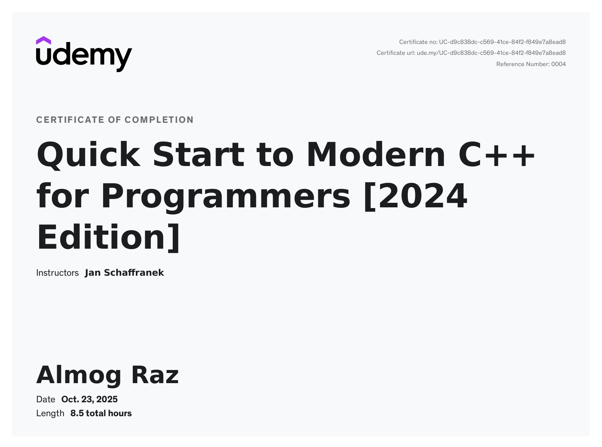

```markdown
# CppCourse

<!-- Certificate (large embedded) -->

<p align="center">
  
</p>

This repository contains C++ course materials. The certificate above shows completion of "Quick Start to Modern C++ for Programmers [2024 Edition]".
```
